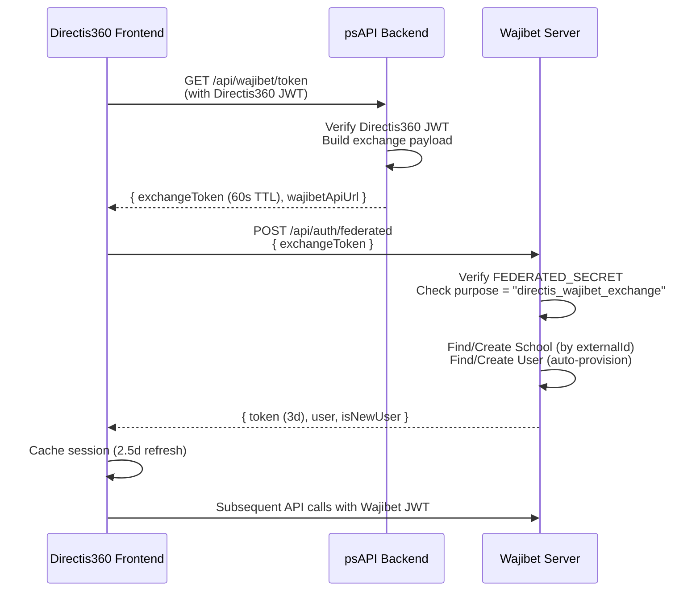

# EDZ Architecture Context

> **Generated**: 2026-06-15 | **Status**: Strict architectural reference for all future development  
> **Scope**: High-level discovery only — no deep component/logic reads performed.

---

## 1. Repository Overview

This monorepo contains **two entangled MERN-stack platforms** and a **shared backend API**:

| Platform | Purpose | Type |
|----------|---------|------|
| **MadrassaPlay** (Wajibet) | Public school organization + game modules | Full-stack (Vite + Express) |
| **Directis360** | Private school management (no games, receives game modules from Wajibet) | Next.js 15 frontend + psAPI backend |
| **psAPI** | Directis360's dedicated backend API | Express.js (ESM) |

### Integration Summary

```
┌──────────────────────┐         Federated Auth (JWT)        ┌──────────────────────┐
│                      │ ◄──────────────────────────────────► │                      │
│   Directis360        │         Exchange Token Flow          │   MadrassaPlay       │
│   (Next.js 15)       │                                      │   (Wajibet)          │
│                      │         Game API (REST)              │                      │
│   Port: 3000         │ ──────────────────────────────────► │   Port: 5173 (client)│
│                      │         Socket.io (Real-time)        │   Port: 5000 (server)│
│                      │ ◄──────────────────────────────────► │                      │
└──────────┬───────────┘                                      └──────────────────────┘
           │
           │ REST API
           ▼
┌──────────────────────┐
│   psAPI              │
│   (Express.js ESM)   │
│   Dedicated Backend  │
│   for Directis360    │
└──────────────────────┘
```

---

## 2. Folder Structures

### 2.1 Root

```
Linking-Directies-wajibet/
├── .git/
├── .gitattributes
├── .gitignore
├── Directis360-main/          # Private school management frontend (Next.js 15)
├── MadrassaPlay/              # Public school + games platform (Vite + Express)
│   ├── client/                # React frontend (Vite)
│   └── server/                # Express.js backend
├── psAPI/                     # Directis360's dedicated backend API
└── EDZ-ARCHITECTURE-CONTEXT.md
```

---

### 2.2 MadrassaPlay (Wajibet)

#### Client — `MadrassaPlay/client/`

```
client/
├── package.json               # name: "skill-snap-client"
├── vite.config.js             # Dev server :5173, proxies /api → :5000
├── tailwind.config.js
├── index.html
├── public/
├── dist/                      # Production build output
└── src/
    ├── main.jsx               # Entry point
    ├── App.jsx                # Router & layout (react-router-dom v7)
    ├── App.css
    ├── index.css
    ├── assets/
    ├── components/
    │   ├── ProtectedRoute.jsx
    │   ├── RoleBasedRedirect.jsx
    │   ├── admin/
    │   ├── analytics/
    │   ├── finance/
    │   ├── landing/
    │   ├── layout/
    │   ├── manager/
    │   ├── payments/
    │   ├── shared/
    │   ├── staff/
    │   ├── student/
    │   └── teacher/
    ├── context/
    │   ├── AuthContext.jsx
    │   ├── LanguageContext.jsx
    │   ├── SocketContext.jsx
    │   └── TemplateContext.jsx
    ├── lib/
    │   └── translations.js    # i18n (367 KB)
    ├── pages/
    │   ├── AdminDashboard.jsx
    │   ├── CreateGame.jsx     # Game creation (78 KB — major feature)
    │   ├── EditGame.jsx       # Game editing (79 KB — major feature)
    │   ├── Finance.jsx
    │   ├── FullScreenModelViewer.jsx
    │   ├── HostLobby.jsx      # Real-time game hosting
    │   ├── LandingPage.jsx    # Public landing (54 KB)
    │   ├── Login.jsx
    │   ├── ManagerDashboard.jsx
    │   ├── ManagerPasswordReset.jsx
    │   ├── PlayGame.jsx       # Game playing engine
    │   ├── PlayerLobby.jsx    # Student joins lobby
    │   ├── Profile.jsx        # User profile (53 KB)
    │   ├── PublicSchoolLandingPage.jsx
    │   ├── PublicSchoolPage.jsx
    │   ├── SharedModelViewer.jsx
    │   ├── StudentAnnouncements.jsx
    │   ├── StudentDashboard.jsx  # Student view (36 KB)
    │   ├── TeacherDashboard.jsx
    │   ├── Test3DViewer.jsx
    │   ├── TutorialVideo.jsx
    │   └── ViewResults.jsx
    ├── services/
    │   ├── chartCaptureService.js
    │   ├── enhancedPdfExportService.js
    │   ├── fallbackPdfExportService.js
    │   ├── model3dService.js
    │   ├── pdfExportService.js
    │   └── shareService.js
    ├── styles/
    └── utils/
```

#### Server — `MadrassaPlay/server/`

```
server/
├── package.json               # name: "skill-snap-server"
├── server.js                  # Entry point (Express + Socket.io)
├── app.js                     # Express app setup
├── .env                       # Environment config
├── ecosystem.config.js        # PM2 config
├── nodemon.json
├── seed-admin.js
├── realtimeState.js           # Socket.io state tracking
├── safe-route-loader.js
├── debug-routes.js
├── config/
│   ├── db.js                  # MongoDB connection (mongoose)
│   └── migrations.js          # Data migrations
├── controllers/               # 33 controllers
│   ├── advertisementController.js
│   ├── analyticsController.js
│   ├── announcementController.js
│   ├── assignmentController.js
│   ├── attendanceController.js
│   ├── badgeController.js
│   ├── catalogController.js
│   ├── classController.js
│   ├── classResourceController.js
│   ├── employeeController.js
│   ├── enrollmentController.js
│   ├── equipmentController.js
│   ├── financeController.js
│   ├── gameCreationController.js     # ← Game module (15 KB)
│   ├── gameResultController.js       # ← Game module (18 KB)
│   ├── gameTemplateController.js     # ← Game module (10 KB)
│   ├── landingPageAnalyticsController.js
│   ├── landingPagePublicController.js
│   ├── leaderboardController.js      # ← Game module
│   ├── liveSessionController.js      # ← Game module (13 KB)
│   ├── logController.js
│   ├── managerController.js
│   ├── paymentController.js
│   ├── reportingController.js
│   ├── roomController.js
│   ├── schoolController.js
│   ├── schoolDocumentController.js
│   ├── sharedModelController.js
│   ├── staffController.js
│   ├── studentController.js          # Largest controller (48 KB)
│   ├── teacherController.js
│   ├── templateBadgeController.js
│   └── userController.js
├── middleware/
│   ├── authMiddleware.js
│   ├── permissionMiddleware.js
│   ├── schoolValidation.js
│   └── uploadMiddleware.js
├── models/                    # 36 Mongoose models
│   ├── User.js
│   ├── School.js
│   ├── Class.js
│   ├── Student.js
│   ├── Employee.js
│   ├── Enrollment.js
│   ├── GameCreation.js        # ← Game module
│   ├── GameTemplate.js        # ← Game module
│   ├── GameResult.js          # ← Game module
│   ├── LiveSession.js         # ← Game module
│   ├── LiveParticipant.js     # ← Game module
│   ├── Assignment.js
│   ├── Badge.js / TemplateBadge.js / EarnedTemplateBadge.js
│   ├── Payment.js / ManualTransaction.js / MonthlyFinancialSummary.js
│   ├── Attendance.js
│   ├── SchoolCatalog.js / SchoolDocument.js
│   └── ... (Advertisement, Room, Equipment, etc.)
├── routes/                    # 33 route files
│   ├── userRoutes.js
│   ├── schoolRoutes.js
│   ├── classRoutes.js
│   ├── studentRoutes.js
│   ├── teacherRoutes.js
│   ├── enrollmentRoutes.js
│   ├── gameCreationRoutes.js  # ← Game module
│   ├── gameTemplateRoutes.js  # ← Game module
│   ├── gameResultRoutes.js    # ← Game module
│   ├── liveSessionRoutes.js   # ← Game module
│   ├── leaderboardRoutes.js   # ← Game module
│   ├── federatedAuthRoutes.js # ← Directis360 integration
│   ├── financeRoutes.js
│   ├── paymentRoutes.js
│   ├── assignmentRoutes.js
│   └── ... (33 total)
├── services/
│   ├── attemptGate.js
│   ├── enrollmentFinanceService.js
│   ├── loggingService.js
│   ├── monthlyAggregationService.js
│   ├── schoolDeletionService.js
│   ├── studentLogService.js
│   └── teacherPayoutService.js
├── socket/
│   └── socketHandler.js       # Real-time game session handler (17 KB)
├── scripts/
├── uploads/
├── public/
└── utils/
    ├── defaultLandingPageTemplate.js
    ├── permissionUtils.js
    └── sendEmail.js
```

---

### 2.3 Directis360 (Frontend)

```
Directis360-main/
├── package.json               # name: "my-v0-project" (Next.js 15)
├── next.config.mjs
├── tailwind.config.ts
├── postcss.config.mjs
├── tsconfig.json
├── components.json            # shadcn/ui config (Radix + lucide)
├── app/
│   ├── globals.css
│   ├── layout.tsx             # Root layout
│   ├── page.tsx               # Landing page (12 KB)
│   ├── login/
│   ├── signup/
│   ├── logout-success/
│   ├── no-active-subscription/
│   ├── tg/                    # Telegram integration
│   ├── admin/
│   │   ├── page.tsx
│   │   └── dashboard/
│   └── dashboard/
│       ├── page.tsx           # Dashboard router
│       ├── headmaster/
│       │   └── page.tsx
│       ├── teacher/
│       │   └── page.tsx
│       ├── student/
│       │   └── page.tsx
│       ├── staff/
│       │   ├── page.tsx
│       │   ├── assets/
│       │   ├── attendance/
│       │   ├── finance/
│       │   └── pedagogy/
│       └── parent/
│           └── page.tsx
├── components/
│   ├── signup.tsx
│   ├── theme-provider.tsx
│   ├── ui/                    # shadcn/ui primitives
│   ├── admin/
│   ├── analytics/
│   ├── assets/
│   ├── attendance/
│   ├── dashboard/
│   ├── dialogs/
│   ├── finance/
│   ├── layout/
│   ├── pedagogy/
│   └── settings/
├── context/
│   ├── AuthContext.tsx
│   └── language-context.tsx
├── data/
│   ├── countriesData.json     # (4 MB)
│   └── school-structure.ts    # (92 KB — school data schemas)
├── hooks/
│   ├── use-local-storage.ts
│   ├── use-mobile.tsx
│   ├── use-toast.ts
│   ├── useDebounce.tsx
│   └── useWajibetSocket.ts   # ← Wajibet real-time integration
├── lib/
│   ├── api.ts                 # Axios instance → psAPI
│   ├── translations.ts        # i18n (411 KB)
│   └── utils.ts
├── services/
│   ├── authService.ts
│   ├── masterService.ts       # Headmaster operations
│   ├── adminSchoolsService.ts
│   ├── studentService.ts
│   ├── teacherService.ts
│   ├── parentService.ts
│   ├── staffService.ts
│   ├── staffPedagogyService.ts    # (23 KB — large)
│   ├── staffFinanceService.ts     # (9 KB)
│   ├── staffAttendanceService.ts  # (6 KB)
│   ├── staffAssetsService.ts
│   ├── staffTabsService.ts
│   ├── meetings.ts
│   ├── assetService.ts
│   └── wajibetService.ts     # ← Wajibet API integration layer
├── styles/
├── types/
│   └── meeting.ts
└── public/
```

---

### 2.4 psAPI (Directis360 Backend)

```
psAPI/
├── package.json               # Express 5 (ESM modules)
├── app.js                     # Entry point — mounts all routes
├── config/
│   └── env.js                 # dotenv loader (PORT, DB_URI, JWT_SECRET, etc.)
├── database/
│   └── mongodb.js             # Mongoose connection
├── controllers/
│   └── admin.controller.js    # Single controller (11 KB)
├── middlewares/                # 13 middleware files
│   ├── auth.middleware.js
│   ├── authAdmin.middleware.js
│   ├── authCommunity.middleware.js
│   ├── authMaster.middleware.js
│   ├── authParent.middleware.js
│   ├── authStaff.middleware.js
│   ├── authStudent.middleware.js
│   ├── authTabAcees.middleware.js
│   ├── authTeacher.middleware.js
│   ├── checkSubscription.middleware.js
│   ├── error.middleware.js
│   ├── upload.middleware.js
│   └── uploadForStudent.middleware.js
├── models/                    # 18 Mongoose models
│   ├── school.model.js        # (5 KB)
│   ├── member.model.js
│   ├── groupe.model.js        # (5 KB — class/group)
│   ├── student.model.js
│   ├── teacher.model.js
│   ├── parent.model.js
│   ├── admin.model.js
│   ├── attendance.model.js
│   ├── studentsAttendance.model.js
│   ├── mark.model.js          # (4 KB — grading)
│   ├── schedule.model.js
│   ├── specialities.model.js
│   ├── asset.model.js
│   ├── maintenance.model.js
│   ├── meeting.model.js
│   ├── communityPost.model.js
│   ├── finance/               # Finance sub-models
│   ├── spec.json              # (136 KB — API/data spec)
│   └── models.zip             # Archive
├── routes/                    # 15 route files
│   ├── auth.routes.js
│   ├── headmaster.routes.js   # (16 KB)
│   ├── teachers.routes.js     # (17 KB)
│   ├── students.routes.js
│   ├── parent.routes.js
│   ├── admin.routes.js
│   ├── pedagogy.routes.js     # (77 KB — largest route file)
│   ├── assets.routes.js
│   ├── Attendance.routes.js
│   ├── finance.routes.js      # (27 KB)
│   ├── help.routes.js
│   ├── community.routes.js    # (20 KB)
│   ├── meeting.routes.js      # (17 KB)
│   ├── tgbot.routes.js        # Telegram bot
│   └── wajibet.routes.js      # ← Wajibet exchange token endpoint
├── scripts/
└── utils/
```

---

## 3. Route Mounting (psAPI → Directis360)

From `psAPI/app.js`:

| Mount Point | Router | Description |
|-------------|--------|-------------|
| `/api/v1/auth` | `authRouter` | Authentication (login, register, tokens) |
| `/api/head/` | `headmasterRouter` | Headmaster operations |
| `/api/teacher/` | `teachersRouter` | Teacher CRUD & operations |
| `/api/student/` | `studentsRouter` | Student CRUD & operations |
| `/api/parent/` | `parentRouter` | Parent portal |
| `/api/staff/pedagogy` | `pedagogyRouter` | Pedagogy management (largest: 77 KB) |
| `/api/staff/assets` | `assetsRouter` | School asset management |
| `/api/staff/finance` | `financeRouter` | Financial operations |
| `/api/staff/attendance` | `attendanceRouter` | Attendance tracking |
| `/api/help` | `helpRouter` | Help/support system |
| `/api/community/` | `communityRouter` | Community posts |
| `/api/meetings/` | `meetingRouter` | Meeting management |
| `/api/tgbot/` | `tgbot` | Telegram bot webhook |
| `/api/admin/` | `adminRouter` | Admin panel |
| **`/api/wajibet`** | **`wajibetRouter`** | **Wajibet integration (exchange tokens)** |

---

## 4. Data Flow: Directis360 ↔ Wajibet (Federated Auth)

This is the **critical integration surface** linking the two platforms.

### 4.1 Authentication Flow



### 4.2 Shared Secret

Both platforms share a `FEDERATED_SECRET` environment variable used to sign/verify the short-lived exchange JWT:

| Platform | Config Location | Variable |
|----------|----------------|----------|
| psAPI | `.env.{NODE_ENV}.local` | `FEDERATED_SECRET` (via env.js → process.env) |
| Wajibet Server | `MadrassaPlay/server/.env` | `FEDERATED_SECRET` |

### 4.3 Role Mapping

Directis360 roles are translated to Wajibet roles during auto-provisioning:

| Directis360 Role | Wajibet Role |
|-------------------|--------------|
| `TEACHER` | `teacher` |
| `STUDENT` | `student` |
| `HEADMASTER` | `manager` |
| `STAFF` | `staff` |
| `PARENT` | `student` |

### 4.4 Auto-Provisioning (Wajibet Side)

On first federated login, Wajibet automatically creates:
1. **School** — matched by `externalId` + `externalSource: 'directis360'`, or auto-named `School-{last6chars}`
2. **User** — matched by `externalId` + `externalSource: 'directis360'`, with random password (never used)

### 4.5 Exchange Token Payload

```json
{
  "purpose": "directis_wajibet_exchange",
  "version": 1,
  "directisUserId": "<string>",
  "directisSchoolId": "<string>",
  "role": "TEACHER | STUDENT | HEADMASTER | STAFF | PARENT",
  "full_name": "<string | null>",
  "phone_number": "<string | null>",
  "email": "<string | null>",
  "national_ID": "<string | null>"
}
```

---

## 5. Real-Time Communication

### 5.1 Wajibet Socket.io (MadrassaPlay Server)

- **Server**: `MadrassaPlay/server/socket/socketHandler.js` (17 KB)
- **Client (native)**: `MadrassaPlay/client/src/context/SocketContext.jsx`
- **Client (Directis360)**: `Directis360-main/hooks/useWajibetSocket.ts`

Directis360 connects to Wajibet's Socket.io server at `NEXT_PUBLIC_WAJIBET_API_URL` using the cached Wajibet JWT, emitting `identify` on connect.

### 5.2 Key Real-Time Features

- Live game sessions (host/player lobbies)
- Real-time game state synchronization
- Student participation tracking

---

## 6. Game Module Architecture (Shared Between Platforms)

Games live entirely in Wajibet but are consumed by Directis360:

### 6.1 Wajibet Game Models

| Model | Purpose |
|-------|---------|
| `GameTemplate` | Reusable game templates with form schemas |
| `GameCreation` | Teacher-created game instances from templates |
| `GameResult` | Student game attempt results |
| `LiveSession` | Real-time game sessions |
| `LiveParticipant` | Participants in live sessions |
| `Assignment` | Game assignments linked to classes |

### 6.2 Directis360 Game API Surface

Directis360 accesses Wajibet games through `services/wajibetService.ts`:

| API Group | Endpoints |
|-----------|-----------|
| `gamesApi` | `getMyGames`, `getTemplates`, `getTemplateById`, `createGame`, `getGame`, `updateGame`, `deleteGame`, `getResults`, `getResultDetail` |
| `sessionsApi` | `list`, `getDetails`, `getSummary`, `create`, `end`, `delete` |
| `studentApi` | `getMyAssignments`, `getMyAssignmentsDetailed`, `getGameCreation`, `submitResult`, `getMyResultsSummary`, `getMyRecentResults` |

---

## 7. Dependency Analysis

### 7.1 MadrassaPlay Client (`skill-snap-client`)

| Category | Key Dependencies |
|----------|-----------------|
| **Framework** | React 19, Vite 7, react-router-dom 7 |
| **Styling** | TailwindCSS 3, lucide-react |
| **Charts** | chart.js + react-chartjs-2, recharts 3 |
| **Real-time** | socket.io-client 4 |
| **3D** | three.js 0.180, @types/three |
| **PDF/Export** | jspdf, html2canvas |
| **Media** | react-player, react-barcode, react-qr-code |
| **Email** | @emailjs/browser, emailjs-com |

### 7.2 MadrassaPlay Server (`skill-snap-server`)

| Category | Key Dependencies |
|----------|-----------------|
| **Framework** | Express 5 |
| **Database** | Mongoose 8 |
| **Auth** | jsonwebtoken, bcryptjs |
| **Real-time** | socket.io 4 |
| **Files** | multer 2, adm-zip, fs-extra |
| **Dev** | nodemon, jest, supertest, mongodb-memory-server |

### 7.3 Directis360 (`my-v0-project`)

| Category | Key Dependencies |
|----------|-----------------|
| **Framework** | Next.js 15, React 18, TypeScript 5 |
| **UI Library** | shadcn/ui (Radix UI primitives), lucide-react |
| **Styling** | TailwindCSS 3, tailwindcss-animate, tailwind-merge |
| **State/Forms** | react-hook-form, @hookform/resolvers, zod |
| **Charts** | recharts 2.15 |
| **Real-time** | socket.io-client 4 |
| **Animation** | framer-motion 12 |
| **Maps** | leaflet |
| **PDF** | jspdf, jspdf-autotable |
| **HTTP** | axios |
| **Theming** | next-themes |
| **Notifications** | sonner, react-hot-toast |

### 7.4 psAPI

| Category | Key Dependencies |
|----------|-----------------|
| **Framework** | Express 5 (ESM) |
| **Database** | Mongoose 8, mongodb 6 (native driver also present) |
| **Auth** | jsonwebtoken, bcryptjs |
| **Files** | multer 2 |
| **Utilities** | dayjs, node-fetch, cookie-parser, body-parser |

### 7.5 Shared Dependencies Across Platforms

| Dependency | Wajibet Client | Wajibet Server | Directis360 | psAPI |
|------------|:-:|:-:|:-:|:-:|
| axios | ✓ | — | ✓ | — |
| socket.io / socket.io-client | ✓ | ✓ | ✓ | — |
| mongoose | — | ✓ | — | ✓ |
| jsonwebtoken | — | ✓ | — | ✓ |
| bcryptjs | — | ✓ | — | ✓ |
| multer | — | ✓ | — | ✓ |
| Express 5 | — | ✓ | — | ✓ |
| recharts | ✓ | — | ✓ | — |
| lucide-react | ✓ | — | ✓ | — |
| TailwindCSS 3 | ✓ | — | ✓ | — |
| jspdf | ✓ | — | ✓ | — |
| dayjs | — | — | ✓ | ✓ |

---

## 8. Environment Configuration

### 8.1 MadrassaPlay Server (`MadrassaPlay/server/.env`)

| Variable | Default | Purpose |
|----------|---------|---------|
| `NODE_ENV` | `development` | Environment mode |
| `PORT` | `5000` | Server port |
| `MONGO_URI` | `mongodb://localhost:27017/madrassaplay` | MongoDB connection |
| `JWT_SECRET` | — | JWT signing secret |
| `CORS_ORIGIN` | `http://localhost:5173` | Allowed CORS origin |
| `FEDERATED_SECRET` | — | **Cross-platform auth secret** |
| `DIRECTIS_ORIGIN` | `http://localhost:3000` | Directis360 URL |
| `ENABLE_SCHOOL_DELETION_CRON` | `false` | Safety toggle |
| `BACKUP_ON_START` | `false` | Auto-backup toggle |

### 8.2 MadrassaPlay Client (`vite.config.js`)

| Variable | Default | Purpose |
|----------|---------|---------|
| `VITE_BACKEND_URL` / `BACKEND_URL` | `http://localhost:5000` | Backend API target |

### 8.3 psAPI (`config/env.js` → `.env.{NODE_ENV}.local`)

| Variable | Purpose |
|----------|---------|
| `PORT` | Server port |
| `NODE_ENV` | Environment mode |
| `DB_URI` | MongoDB connection |
| `JWT_SECRET` | JWT signing |
| `JWT_REFRESH_SECRET` | Refresh token signing |
| `TAB_SECRET` | Tab access control |
| `Host` | CORS whitelist origin |
| `TELEGRAM_CHAT_ID` | Telegram bot target |
| `TELEGRAM_BOT_TOKEN` | Telegram bot auth |
| `FEDERATED_SECRET` | **Cross-platform auth secret** |
| `WAJIBET_API_URL` | Wajibet API target |

### 8.4 Directis360 (`next.config.mjs` + env vars)

| Variable | Purpose |
|----------|---------|
| `NEXT_PUBLIC_API_URL` | psAPI base URL (used in `lib/api.ts`) |
| `NEXT_PUBLIC_WAJIBET_API_URL` | Wajibet API URL (used in `wajibetService.ts`) |

---

## 9. Database Architecture

### 9.1 Separate MongoDB Databases

| Database | Used By | Default URI |
|----------|---------|-------------|
| `madrassaplay` | MadrassaPlay Server | `mongodb://localhost:27017/madrassaplay` |
| _(configured via DB_URI)_ | psAPI | `.env.{NODE_ENV}.local` |

### 9.2 Cross-Database References

Wajibet stores `externalId` + `externalSource: 'directis360'` on its `User` and `School` models to link back to psAPI entities. **There is no direct DB cross-reference** — all communication is via REST API.

---

## 10. Build & Run Scripts

| Platform | Dev Command | Build Command | Entry |
|----------|-------------|---------------|-------|
| MadrassaPlay Client | `npm run dev` (Vite :5173) | `npm run build` | `index.html` |
| MadrassaPlay Server | `npm start` (nodemon) | — | `server.js` |
| Directis360 | `npm run dev` (Next.js :3000) | `npm run build` | `app/layout.tsx` |
| psAPI | `npm run dev` (nodemon) | — | `app.js` |

### Dev Port Map

| Port | Service |
|------|---------|
| `3000` | Directis360 (Next.js) |
| `5000` | MadrassaPlay Server (Express) |
| `5173` | MadrassaPlay Client (Vite) |
| _(env)_ | psAPI (Express) |

---

## 11. Key Integration Files Reference

| File | Platform | Purpose |
|------|----------|---------|
| `psAPI/routes/wajibet.routes.js` | psAPI | Exchange token generation (Directis360 → Wajibet) |
| `MadrassaPlay/server/routes/federatedAuthRoutes.js` | Wajibet | Token exchange + auto-provisioning |
| `Directis360-main/services/wajibetService.ts` | Directis360 | Wajibet API client (games, sessions, students) |
| `Directis360-main/hooks/useWajibetSocket.ts` | Directis360 | Socket.io connection to Wajibet |
| `MadrassaPlay/server/socket/socketHandler.js` | Wajibet | Real-time game session management |
| `MadrassaPlay/client/src/context/SocketContext.jsx` | Wajibet | Client-side socket context |

---

## 12. Architectural Notes

> [!IMPORTANT]
> **Module Boundary Rule**: Games exist **only** in Wajibet. Directis360 accesses them exclusively through the Wajibet REST API and Socket.io — never via direct database access.

> [!WARNING]
> **React Version Mismatch**: MadrassaPlay Client uses React 19, while Directis360 uses React 18. This is not a runtime issue (they're separate apps) but may cause confusion during development.

> [!NOTE]
> **Naming Inconsistency**: The project uses several names interchangeably: "MadrassaPlay" = "Wajibet" = "skill-snap" (package.json name). "Directis360" = "my-v0-project" (package.json name). "psAPI" has no package name.

> [!NOTE]
> **Large Files**: Several page-level files exceed 50 KB (CreateGame, EditGame, LandingPage, Profile, StudentDashboard). These are potential refactoring candidates but should NOT be split without explicit request.

> [!NOTE]
> **i18n**: Both platforms maintain independent, large translation files (~367-411 KB each). There is no shared translation system.
